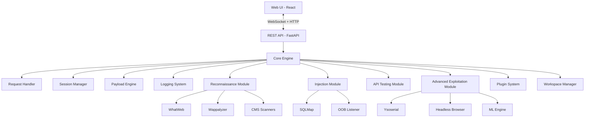

# VulnChain CTF Framework - Design Document

## Overview

VulnChain is a comprehensive web exploitation framework designed for CTF competitions and authorized security testing. The system employs a modular architecture with a Python-based backend engine, a React-based web UI, and integrated third-party security tools. The framework emphasizes automation, speed, and intelligent vulnerability detection to provide competitive advantages in time-constrained CTF environments.

### Key Design Principles

1. **Modularity**: Each attack module operates independently with well-defined interfaces
2. **Extensibility**: Plugin architecture allows custom modules without core modifications
3. **Performance**: Asynchronous I/O and multi-threading for concurrent operations
4. **Intelligence**: ML-based prediction and adaptive attack strategies
5. **Usability**: Intuitive web UI with real-time feedback and one-click exploitation

## Architecture

### High-Level Architecture



### Technology Stack

**Backend:**
- Python 3.11+ (Core framework)
- FastAPI (REST API and WebSocket server)
- aiohttp (Async HTTP client)
- httpx (HTTP/2 support)
- SQLAlchemy (Database ORM)
- Redis (Session storage and caching)
- Celery (Background task processing)

**Frontend:**
- React 18+ (UI framework)
- TypeScript (Type safety)
- TanStack Query (Data fetching)
- Zustand (State management)
- Monaco Editor (Code editor for payloads)
- Recharts (Visualization)

**Security Tools Integration:**
- WhatWeb (Technology fingerprinting)
- Wappalyzer (Client-side detection)
- SQLMap (SQL injection)
- WPScan, Droopescan, JoomScan (CMS scanning)
- ysoserial, phpggc (Deserialization)
- Playwright (Headless browser)

**ML/AI:**
- scikit-learn (Vulnerability prediction)
- transformers (NLP for error analysis)
- TensorFlow Lite (Lightweight inference)

## Components and Interfaces

### 1. Core Engine

The central orchestrator that manages all framework operations.

**Interface:**
```python
class CoreEngine:
    def __init__(self, config: Config):
        self.request_handler = RequestHandler(config)
        self.session_manager = SessionManager()
        self.payload_engine = PayloadEngine()
        self.logger = Logger(config)
        self.workspace_manager = WorkspaceManager()
        self.plugin_system = PluginSystem()
        
    async def execute_module(self, module_name: str, params: dict) -> Result:
        """Execute an attack module with given parameters"""
        
    async def scan_target(self, target: Target) -> ScanResult:
        """Perform comprehensive target scanning"""
        
    def get_module(self, name: str) -> Module:
        """Retrieve a registered module"""
```

### 2. Request Handler

Manages all HTTP/HTTPS communication with configurable options.

**Interface:**
```python
class RequestHandler:
    async def send_request(
        self,
        method: str,
        url: str,
        headers: dict = None,
        data: Any = None,
        cookies: dict = None,
        proxy: str = None,
        timeout: float = 30.0,
        follow_redirects: bool = True,
        http2: bool = False
    ) -> Response:
        """Send HTTP request with full control"""
        
    async def send_batch(self, requests: List[Request]) -> List[Response]:
        """Send multiple requests concurrently"""
        
    def apply_waf_bypass_profile(self, profile_name: str):
        """Apply WAF bypass header configuration"""
```

**Response Object:**
```python
@dataclass
class Response:
    status_code: int
    headers: dict
    body: bytes
    text: str
    elapsed_time: float
    request: Request
    history: List[Response]  # Redirect chain
```

### 3. Session Manager

Handles authentication state and cookie management.

**Interface:**
```python
class SessionManager:
    def capture_session(self, response: Response) -> Session:
        """Extract and store session from response"""
        
    def get_session(self, domain: str) -> Session:
        """Retrieve active session for domain"""
        
    def export_session(self, session_id: str, format: str) -> bytes:
        """Export session to file"""
        
    def import_session(self, data: bytes) -> Session:
        """Import session from file"""
        
    def apply_session(self, request: Request, session: Session) -> Request:
        """Apply session cookies to request"""
```

### 4. Payload Engine

Centralized payload management with encoding and mutation capabilities.

**Interface:**
```python
class PayloadEngine:
    def load_wordlist(self, path: str, category: str):
        """Load wordlist into memory"""
        
    def get_payloads(
        self,
        category: str,
        encoding: List[str] = None,
        filters: dict = None
    ) -> Iterator[str]:
        """Get payloads with optional encoding"""
        
    def mutate_payload(
        self,
        payload: str,
        strategy: MutationStrategy
    ) -> List[str]:
        """Generate payload mutations"""
        
    def encode_payload(self, payload: str, encoding: str) -> str:
        """Apply encoding to payload"""
```

**Supported Encodings:**
- URL encoding (single and double)
- HTML entity encoding
- Base64
- Unicode escaping
- Hex encoding
- Case variation

### 5. Logging System

Structured logging with real-time streaming and flag extraction.

**Interface:**
```python
class Logger:
    def log_request(self, request: Request, response: Response):
        """Log HTTP transaction"""
        
    def log_finding(self, finding: Finding):
        """Log security finding"""
        
    def extract_flags(self, text: str) -> List[str]:
        """Extract CTF flags from text"""
        
    def export_report(self, format: str, workspace_id: str) -> bytes:
        """Generate report in specified format"""
        
    def stream_logs(self) -> AsyncIterator[LogEntry]:
        """Stream logs in real-time via WebSocket"""
```

### 6. OOB Listener

Out-of-band callback listener for blind vulnerability detection.

**Interface:**
```python
class OOBListener:
    def start(self, http_port: int = 8080, dns_port: int = 53):
        """Start HTTP and DNS listeners"""
        
    def generate_unique_id(self) -> str:
        """Generate unique identifier for correlation"""
        
    def get_callback_url(self, unique_id: str) -> str:
        """Get callback URL with unique identifier"""
        
    async def wait_for_callback(
        self,
        unique_id: str,
        timeout: float = 30.0
    ) -> Optional[Callback]:
        """Wait for callback with timeout"""
        
    def get_callbacks(self, unique_id: str = None) -> List[Callback]:
        """Retrieve captured callbacks"""
```

### 7. Module System

Base class for all attack modules.

**Interface:**
```python
class Module(ABC):
    @abstractmethod
    async def execute(self, target: Target, params: dict) -> ModuleResult:
        """Execute module attack logic"""
        
    @abstractmethod
    def get_metadata(self) -> ModuleMetadata:
        """Return module information"""
        
    def validate_params(self, params: dict) -> bool:
        """Validate input parameters"""
```

### 8. Reconnaissance Module

Handles target discovery and fingerprinting.

**Key Components:**
- Technology fingerprinting (WhatWeb, Wappalyzer)
- Directory/file fuzzing
- Subdomain enumeration
- Parameter discovery
- JavaScript analysis
- API schema discovery

### 9. Injection Module

Automated injection testing across multiple vulnerability classes.

**Key Components:**
- SQL injection (time-based, boolean, error-based)
- Command injection (with OOB)
- SSRF (with filter bypass)
- XXE (with OOB exfiltration)
- Directory traversal
- SSTI detection and exploitation
- NoSQL injection

### 10. API Testing Module

Specialized testing for modern APIs.

**Key Components:**
- JWT manipulation
- OAuth/SAML exploitation
- GraphQL introspection and testing
- REST API fuzzing
- WebSocket testing
- Server-Sent Events testing

### 11. Advanced Exploitation Module

Cutting-edge exploitation techniques.

**Key Components:**
- Deserialization exploitation
- Race condition testing
- Cache poisoning
- Prototype pollution
- File upload bypass
- ML model exploitation
- Browser-based exploitation

### 12. WAF Bypass Engine

Intelligent WAF detection and evasion.

**Interface:**
```python
class WAFBypassEngine:
    def detect_waf(self, target: Target) -> Optional[WAFInfo]:
        """Detect WAF presence and vendor"""
        
    def get_bypass_techniques(self, waf_vendor: str) -> List[BypassTechnique]:
        """Get applicable bypass techniques"""
        
    def apply_bypass(
        self,
        payload: str,
        technique: BypassTechnique
    ) -> str:
        """Apply bypass technique to payload"""
        
    async def test_bypass(
        self,
        target: Target,
        payload: str
    ) -> BypassResult:
        """Test if bypass is successful"""
```

**Bypass Techniques:**
- Case variation
- Comment injection
- HTTP parameter pollution
- Multipart boundary abuse
- Charset confusion
- Path normalization
- Header manipulation

### 13. ML Engine

Machine learning for vulnerability prediction and adaptive attacks.

**Interface:**
```python
class MLEngine:
    def predict_vulnerabilities(
        self,
        target_info: TargetInfo
    ) -> List[VulnerabilityPrediction]:
        """Predict likely vulnerabilities"""
        
    def analyze_error_message(self, error: str) -> ErrorAnalysis:
        """Extract hints from error messages"""
        
    def rank_attack_vectors(
        self,
        vectors: List[AttackVector],
        context: dict
    ) -> List[RankedVector]:
        """Rank attack vectors by success probability"""
        
    def learn_from_attempt(
        self,
        attempt: AttackAttempt,
        result: AttackResult
    ):
        """Update models based on attack results"""
```

### 14. Plugin System

Extensibility framework for custom modules.

**Interface:**
```python
class PluginSystem:
    def load_plugin(self, plugin_path: str) -> Plugin:
        """Load plugin from file"""
        
    def register_module(self, module: Module):
        """Register custom attack module"""
        
    def get_plugins(self) -> List[Plugin]:
        """List all loaded plugins"""
        
    def unload_plugin(self, plugin_id: str):
        """Unload plugin"""
```

**Plugin Structure:**
```python
class Plugin:
    name: str
    version: str
    author: str
    modules: List[Module]
    payloads: dict
    config_schema: dict
    
    def initialize(self, core_engine: CoreEngine):
        """Initialize plugin with core engine access"""
```

### 15. Workspace Manager

Multi-challenge organization and state management.

**Interface:**
```python
class WorkspaceManager:
    def create_workspace(self, name: str, metadata: dict) -> Workspace:
        """Create new workspace"""
        
    def load_workspace(self, workspace_id: str) -> Workspace:
        """Load existing workspace"""
        
    def save_finding(self, workspace_id: str, finding: Finding):
        """Save finding to workspace"""
        
    def export_workspace(self, workspace_id: str) -> bytes:
        """Export workspace archive"""
        
    def import_workspace(self, data: bytes) -> Workspace:
        """Import workspace from archive"""
```

## Data Models

### Target Configuration

```python
@dataclass
class Target:
    url: str
    custom_headers: dict = field(default_factory=dict)
    proxy: Optional[str] = None
    waf_bypass_profile: Optional[str] = None
    session: Optional[Session] = None
    rate_limit: Optional[RateLimit] = None
```

### Session

```python
@dataclass
class Session:
    session_id: str
    domain: str
    cookies: dict
    headers: dict
    created_at: datetime
    expires_at: Optional[datetime]
```

### Finding

```python
@dataclass
class Finding:
    finding_id: str
    workspace_id: str
    vulnerability_type: str
    severity: str  # critical, high, medium, low, info
    title: str
    description: str
    affected_url: str
    proof_of_concept: str
    remediation: str
    discovered_at: datetime
    flags: List[str] = field(default_factory=list)
    evidence: List[Evidence] = field(default_factory=list)
```

### Evidence

```python
@dataclass
class Evidence:
    evidence_type: str  # request, response, screenshot, code
    data: bytes
    description: str
    timestamp: datetime
```

### Workspace

```python
@dataclass
class Workspace:
    workspace_id: str
    name: str
    target: Target
    findings: List[Finding]
    session: Optional[Session]
    metadata: dict
    created_at: datetime
    updated_at: datetime
```

### Module Result

```python
@dataclass
class ModuleResult:
    success: bool
    vulnerability_found: bool
    findings: List[Finding]
    execution_time: float
    error: Optional[str] = None
    metadata: dict = field(default_factory=dict)
```


## Correctness Properties

*A property is a characteristic or behavior that should hold true across all valid executions of a system-essentially, a formal statement about what the system should do. Properties serve as the bridge between human-readable specifications and machine-verifiable correctness guarantees.*

### Property 1: URL Validation Consistency
*For any* URL string provided by a user, the system should validate it according to RFC 3986 standards and either accept valid URLs for storage or reject invalid URLs with clear error messages.
**Validates: Requirements 1.1**

### Property 2: Header Propagation
*For any* set of custom HTTP headers configured by a user, all subsequent HTTP requests to the target should include those exact headers without modification.
**Validates: Requirements 1.2**

### Property 3: Cookie Extraction Completeness
*For any* HTTP response containing Set-Cookie headers, the Session Manager should extract and store all cookies without loss.
**Validates: Requirements 2.1**

### Property 4: Cookie Inclusion
*For any* domain with stored cookies, subsequent requests to that domain should include all applicable cookies in the request headers.
**Validates: Requirements 2.2**

### Property 5: Request Logging Completeness
*For any* HTTP request sent by the Request Handler, the log entry should contain the complete request including method, URL, all headers, and body content.
**Validates: Requirements 3.1**

### Property 6: Flag Extraction Accuracy
*For any* response text containing a flag pattern (matching common CTF formats like `CTF{...}`, `FLAG{...}`, etc.), the system should automatically extract and highlight the flag.
**Validates: Requirements 3.3, 17.3, 48.1**

### Property 7: Fuzzing Request Coverage
*For any* wordlist with N entries, directory fuzzing should generate exactly N HTTP requests, one for each wordlist entry.
**Validates: Requirements 5.1**

### Property 8: OOB Payload Uniqueness
*For any* set of concurrent OOB tests, each generated payload should contain a unique identifier that allows unambiguous correlation with callbacks.
**Validates: Requirements 7.2, 7.5**

### Property 9: OOB Callback Correlation
*For any* OOB callback received by the listener, the system should correctly correlate it with the originating payload using the unique identifier.
**Validates: Requirements 7.3, 17.4**

### Property 10: JWT Decoding Completeness
*For any* valid JWT found in headers or cookies, the JWT Inspector should successfully decode both the header and payload claims without loss of information.
**Validates: Requirements 12.1**

### Property 11: JWT Replacement Consistency
*For any* modified JWT, all subsequent requests should use the modified token instead of the original token.
**Validates: Requirements 12.5**

### Property 12: Encoding Application Correctness
*For any* payload and selected encoding scheme (URL, double URL, HTML entity), the Payload Engine should apply the encoding correctly according to the respective standard.
**Validates: Requirements 18.2**

### Property 13: Encoding Preservation Invariant
*For any* payload that undergoes encoding, the original unencoded payload should be preserved for comparison and logging.
**Validates: Requirements 18.5**

### Property 14: Mutation Semantic Preservation
*For any* payload mutation generated by the system, the semantic meaning of the payload should be preserved while syntax and encoding vary.
**Validates: Requirements 22.5**

### Property 15: Workspace Export-Import Round Trip
*For any* workspace, exporting and then importing should restore the complete state including all configurations, findings, sessions, and logs.
**Validates: Requirements 26.4, 26.5**

### Property 16: Multi-Language Exploit Generation
*For any* confirmed vulnerability, the system should generate exploit code in at least three languages: Python, JavaScript, and Bash.
**Validates: Requirements 27.1**

### Property 17: Team Finding Broadcast
*For any* vulnerability discovered by a team member, all other connected team members should receive the finding in real-time.
**Validates: Requirements 29.2**

### Property 18: Plugin Registration Completeness
*For any* valid plugin installed, all attack modules defined in the plugin should be registered and accessible in the UI.
**Validates: Requirements 30.1**

### Property 19: Technology Fingerprinting Execution
*For any* target scan initiated, the system should execute WhatWeb and Wappalyzer to identify technologies.
**Validates: Requirements 31.1, 31.3**

### Property 20: CMS-Specific Scanner Integration
*For any* detected CMS (WordPress, Drupal, Joomla), the system should automatically execute the corresponding specialized scanner (WPScan, Droopescan, JoomScan).
**Validates: Requirements 32.1, 32.2, 32.3**

### Property 21: JavaScript Extraction Completeness
*For any* web application analyzed, all JavaScript files referenced in HTML should be extracted and parsed.
**Validates: Requirements 33.1**

### Property 22: Subdomain Enumeration Technique Diversity
*For any* root domain provided, subdomain enumeration should employ at least three different techniques: DNS brute-force, certificate transparency logs, and search engine queries.
**Validates: Requirements 34.1**

### Property 23: GraphQL Introspection Execution
*For any* detected GraphQL endpoint, the system should attempt introspection queries to extract the schema.
**Validates: Requirements 35.2**

### Property 24: ML Prediction Generation
*For any* completed reconnaissance phase, the ML engine should generate vulnerability predictions ranked by probability.
**Validates: Requirements 36.1, 36.3**

### Property 25: Race Condition Timing Precision
*For any* race condition test, concurrent requests should be sent with microsecond-level timing control to maximize collision probability.
**Validates: Requirements 37.1**

### Property 26: Deserialization Tool Integration
*For any* deserialization vulnerability test, the system should integrate with appropriate gadget chain generators (ysoserial for Java, phpggc for PHP).
**Validates: Requirements 38.2**

### Property 27: WebSocket Interception Capability
*For any* detected WebSocket connection, the system should provide capabilities to intercept, modify, and replay messages.
**Validates: Requirements 39.1**

### Property 28: Cloud Metadata Access Attempt
*For any* detected SSRF vulnerability, the system should automatically attempt to access cloud metadata services for AWS, Azure, and GCP.
**Validates: Requirements 40.1**

### Property 29: Polyglot File Validity
*For any* generated polyglot file, the file should be simultaneously valid as both an image format and executable code.
**Validates: Requirements 41.1**

### Property 30: NoSQL Operator Coverage
*For any* NoSQL injection test, the system should test multiple operators including `$ne`, `$gt`, `$regex`, and `$where`.
**Validates: Requirements 42.1**

### Property 31: CORS Misconfiguration Test Coverage
*For any* CORS header analysis, the system should test for null origin acceptance, wildcard misconfigurations, and regex bypasses.
**Validates: Requirements 44.1**

### Property 32: OAuth Vulnerability Test Comprehensiveness
*For any* detected OAuth flow, the system should test for redirect_uri bypass, state parameter issues, and token leakage.
**Validates: Requirements 45.1**

### Property 33: ML Endpoint Attack Variety
*For any* detected ML model endpoint, the system should test for prompt injection, jailbreak techniques, and instruction override.
**Validates: Requirements 46.1**

### Property 34: Headless Browser Usage
*For any* JavaScript-heavy application detected, the system should use headless browser automation for rendering and interaction.
**Validates: Requirements 47.1**

### Property 35: Report Format Support
*For any* generated report, the system should support export in at least four formats: Markdown, PDF, HTML, and JSON.
**Validates: Requirements 50.5**

## Error Handling

### Error Categories

1. **Network Errors**
   - Connection timeouts
   - DNS resolution failures
   - SSL/TLS certificate errors
   - Proxy connection failures

2. **Input Validation Errors**
   - Invalid URL formats
   - Malformed payloads
   - Invalid configuration parameters
   - Unsupported file formats

3. **Authentication Errors**
   - Session expiration
   - Invalid credentials
   - Token validation failures
   - OAuth/SAML flow errors

4. **Resource Errors**
   - Insufficient memory
   - Disk space exhaustion
   - Rate limiting exceeded
   - Concurrent connection limits

5. **Integration Errors**
   - External tool failures (WhatWeb, SQLMap, etc.)
   - Plugin loading errors
   - Database connection failures
   - OOB listener binding errors

### Error Handling Strategy

**Graceful Degradation:**
- When external tools fail, continue with built-in capabilities
- When network errors occur, implement exponential backoff retry
- When resources are constrained, reduce concurrency automatically

**User Notification:**
- Display clear error messages in the UI
- Log detailed error information for debugging
- Provide actionable remediation steps
- Show progress indicators during recovery attempts

**Error Recovery:**
- Automatic retry with exponential backoff for transient failures
- Session restoration from saved state after crashes
- Workspace auto-save to prevent data loss
- Graceful shutdown with state preservation

**Error Logging:**
```python
@dataclass
class ErrorLog:
    error_id: str
    timestamp: datetime
    error_type: str
    severity: str  # critical, error, warning, info
    message: str
    stack_trace: Optional[str]
    context: dict  # Request, target, module, etc.
    recovery_attempted: bool
    recovery_successful: Optional[bool]
```

## Testing Strategy

### Unit Testing

**Framework:** pytest for Python backend, Jest for React frontend

**Coverage Requirements:**
- Minimum 80% code coverage for core engine
- 100% coverage for security-critical components (authentication, session management)
- All public APIs must have unit tests

**Key Unit Test Areas:**
- URL validation logic
- Payload encoding/decoding functions
- Session cookie extraction and management
- Flag pattern matching regex
- JWT parsing and manipulation
- Error handling paths
- Configuration validation

**Example Unit Tests:**
```python
def test_url_validation_accepts_valid_urls():
    """Test that valid URLs are accepted"""
    valid_urls = [
        "https://example.com",
        "http://192.168.1.1:8080",
        "https://sub.domain.com/path?query=value"
    ]
    for url in valid_urls:
        assert validate_url(url) == True

def test_cookie_extraction_from_response():
    """Test cookie extraction from Set-Cookie headers"""
    response = create_mock_response(
        headers={"Set-Cookie": "session=abc123; Path=/; HttpOnly"}
    )
    cookies = extract_cookies(response)
    assert cookies["session"] == "abc123"
```

### Property-Based Testing

**Framework:** Hypothesis for Python

**Configuration:** Each property test should run a minimum of 100 iterations to ensure thorough coverage of the input space.

**Key Property Tests:**

1. **URL Validation Property Test**
   - **Feature: vulnchain-ctf-framework, Property 1: URL Validation Consistency**
   - Generate random valid and invalid URLs
   - Verify that valid URLs are accepted and invalid URLs are rejected

2. **Header Propagation Property Test**
   - **Feature: vulnchain-ctf-framework, Property 2: Header Propagation**
   - Generate random header dictionaries
   - Verify headers appear in all subsequent requests

3. **Cookie Round-Trip Property Test**
   - **Feature: vulnchain-ctf-framework, Property 3: Cookie Extraction Completeness**
   - **Feature: vulnchain-ctf-framework, Property 4: Cookie Inclusion**
   - Generate random Set-Cookie headers
   - Verify extraction and inclusion in subsequent requests

4. **Flag Extraction Property Test**
   - **Feature: vulnchain-ctf-framework, Property 6: Flag Extraction Accuracy**
   - Generate random text with embedded flags in various formats
   - Verify all flags are extracted correctly

5. **Encoding Round-Trip Property Test**
   - **Feature: vulnchain-ctf-framework, Property 12: Encoding Application Correctness**
   - **Feature: vulnchain-ctf-framework, Property 13: Encoding Preservation Invariant**
   - Generate random payloads
   - Apply encoding and verify original is preserved
   - Verify decoding returns original payload

6. **Workspace Export-Import Property Test**
   - **Feature: vulnchain-ctf-framework, Property 15: Workspace Export-Import Round Trip**
   - Generate random workspace states
   - Export and import
   - Verify complete state restoration

7. **JWT Manipulation Property Test**
   - **Feature: vulnchain-ctf-framework, Property 10: JWT Decoding Completeness**
   - Generate random valid JWTs
   - Verify complete decoding without information loss

8. **Payload Mutation Semantic Preservation Property Test**
   - **Feature: vulnchain-ctf-framework, Property 14: Mutation Semantic Preservation**
   - Generate random payloads
   - Apply mutations
   - Verify semantic equivalence

**Example Property Test:**
```python
from hypothesis import given, strategies as st

@given(st.text(min_size=1))
def test_flag_extraction_property(text_with_flag):
    """Property: Any text containing a flag pattern should have the flag extracted"""
    # Embed a flag in random text
    flag = f"CTF{{{generate_random_string()}}}"
    text = f"{text_with_flag} {flag} {text_with_flag}"
    
    # Extract flags
    extracted = extract_flags(text)
    
    # Verify the flag was extracted
    assert flag in extracted
    assert len(extracted) >= 1
```

### Integration Testing

**Scope:** Test interactions between major components

**Key Integration Tests:**
- Request Handler + Session Manager: Verify cookie management across requests
- Core Engine + Attack Modules: Verify module execution and result handling
- Payload Engine + Attack Modules: Verify payload delivery and encoding
- OOB Listener + Injection Modules: Verify callback correlation
- Plugin System + Core Engine: Verify plugin integration and API access
- Web UI + Backend API: Verify WebSocket communication and real-time updates

### End-to-End Testing

**Approach:** Test complete attack workflows against intentionally vulnerable applications

**Test Environments:**
- DVWA (Damn Vulnerable Web Application)
- WebGoat
- Juice Shop
- Custom vulnerable test applications

**Test Scenarios:**
- Complete SQL injection workflow: detection → exploitation → data extraction
- SSRF to cloud metadata access
- XXE with OOB exfiltration
- JWT manipulation for privilege escalation
- Complete CTF challenge simulation

### Performance Testing

**Metrics:**
- Request throughput (requests per second)
- Fuzzing speed (payloads per second)
- Memory usage under load
- Response time for UI operations
- Concurrent connection handling

**Load Testing:**
- Test with 1000+ concurrent fuzzing requests
- Test with 100+ concurrent OOB callbacks
- Test workspace with 10,000+ findings
- Test with 50+ active plugins

### Security Testing

**Self-Testing:**
- Input validation for all user inputs
- SQL injection prevention in database queries
- XSS prevention in UI rendering
- CSRF protection for state-changing operations
- Secure session management
- Secure credential storage

**Third-Party Security Review:**
- Regular dependency vulnerability scanning
- Static code analysis (Bandit for Python)
- Dynamic analysis during testing
- Penetration testing of the framework itself

## Implementation Notes

### Performance Optimizations

1. **Asynchronous I/O:** Use asyncio for all network operations to maximize concurrency
2. **Connection Pooling:** Reuse HTTP connections to reduce overhead
3. **Caching:** Cache technology fingerprinting results and DNS lookups
4. **Lazy Loading:** Load plugins and modules on-demand
5. **Database Indexing:** Index workspace findings by vulnerability type and timestamp
6. **Streaming:** Stream large responses and logs to avoid memory exhaustion

### Security Considerations

1. **Sandboxing:** Execute plugins in isolated environments
2. **Input Sanitization:** Validate and sanitize all user inputs
3. **Credential Management:** Use secure storage (keyring) for sensitive data
4. **Audit Logging:** Log all security-relevant operations
5. **Rate Limiting:** Implement rate limiting to prevent abuse
6. **Secure Defaults:** Use secure configurations by default

### Scalability

1. **Horizontal Scaling:** Support distributed execution across multiple machines
2. **Task Queue:** Use Celery for background task processing
3. **Database:** Use PostgreSQL for production deployments
4. **Caching Layer:** Use Redis for session storage and caching
5. **Load Balancing:** Support multiple API server instances

### Deployment

**Development:**
- Docker Compose for local development
- Hot reload for frontend and backend
- SQLite for development database

**Production:**
- Docker containers with orchestration (Kubernetes/Docker Swarm)
- PostgreSQL for production database
- Redis for caching and session storage
- Nginx as reverse proxy
- SSL/TLS termination
- Monitoring and logging (Prometheus, Grafana, ELK stack)

### Future Enhancements

1. **Mobile App:** Native mobile clients for iOS and Android
2. **Cloud Deployment:** One-click cloud deployment options
3. **Marketplace:** Plugin marketplace for community contributions
4. **AI Training:** Continuous learning from CTF results
5. **Collaboration:** Real-time collaborative editing of exploits
6. **Automation:** Fully automated CTF solving mode
7. **Reporting:** Advanced reporting with custom templates
8. **Integration:** Integration with more security tools and platforms
